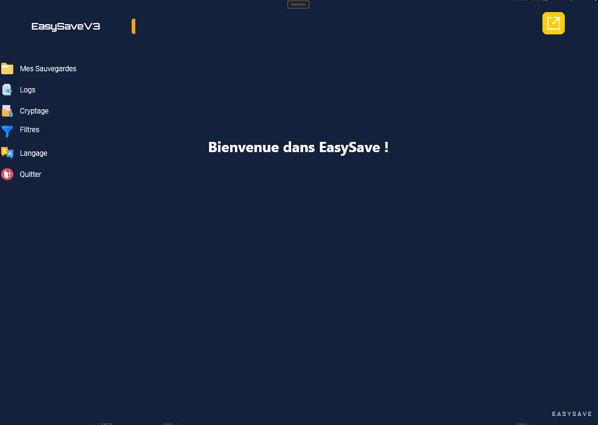

# EasySave - Backup Software

## Description

EasySave is a versatile backup software developed in C# with .NET. It allows users to safeguard their data by storing files and folders on alternative mediums such as external hard drives or the cloud. The software offers features such as selective backup, various backup types, data encryption for enhanced security, and a detailed log system to track operation history. EasySave provides a multilingual interface, available in both French and English.

## Features

- Selective backup of files and folders
- Multiple backup types (full, incremental, etc.)
- Data encryption for enhanced security
- Detailed logs to track operation history
- Multilingual interface (French and English)

## Installation

1. Clone the repository: `git clone https://github.com/ndium/EasySave.git`
2. Open the project in Visual Studio or your preferred C# development environment.
3. Build the solution and run the application.

Follow the on-screen instructions to set up and use EasySave.

## Usage

- Configure backup settings.
- Choose files and folders for backup.
- Select backup type and encryption options.
- Run the backup process.

## Acknowledgments

- Developed during the 3rd year of engineering school in C# with .NET.

## Screenshots

